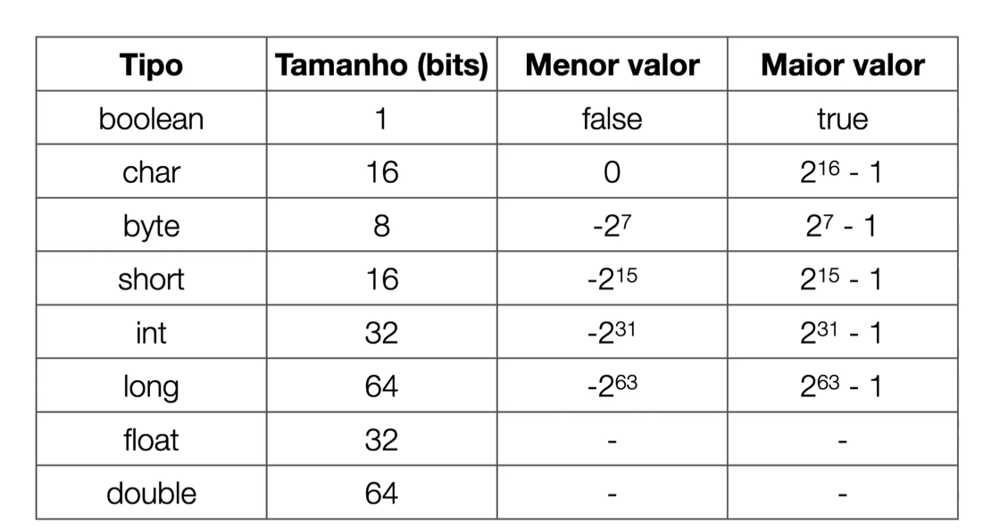

## Anotações

public static void main(String[] args) {} -> Ponto de entrada do programa.

O uso do ; é obrigatório para fechar toda a instrução.

a pasta out surge quando compilamos e ela que guarda os bytescode .class

Java é uma linguagem fortemente tipada, isso é que precisamos declarar o tipo de variavel.

#### Comentarios: 
// Comentarios de uma linha

/* Comentarios de varias linhas */

/** Comentarios JavaDoc */

#### Variaveis
Variaveis são espaços na memória que armazenam dados.

Tipos de variaveis: 
String texto,

int numeroInteiro,

double numeroFlutuante,

boolean verdadeiroOuFalso,

char caracteristicaUnica,

float numeroFlutuante,

long numeroLongo,

byte numeroByte,

short numeroCurto

### Concaternar
Concaternar é a junção de dois ou mais objetos.

### Operadores
Operadores são símbolos que representam operações matemáticas ou lógicas.

### Operadores Aritméticos
Operadores aritméticos são usados para realizar operações matemáticas básicas.
+ adição
- subtração
* multiplicação
/ divisão
% resto

### Operadores Relacionais
Operadores relacionais são usados para comparar valores.

* ,> maior que
 
* < menor que

* == igual a

* != diferente de

* ,>= maior ou igual a

* ,<= menor ou igual a

#### Operadores Logicos - Valida expreções boleanas
* && and (tudo precisa ser verdadeiro)
* || or (um precisa ser verdadeiro)
* ! not (inverte) Ex: !true = false

#### if e else - valida operações boleanas
if (condicao) 
    código a ser executado se a condição for verdadeira

 else 
    // código a ser executado se a condição for falsa

#### Estrutura de repetição 

For 

* for (iniciação; condição; incremento)
* for (int i = 0; i < 10; i++)
o i do for é o indice, serve para guarda o valor de quantas vezes o for vai rodar.

++ operador de incremento
-- operador de decremento

While execulta enquanto tiver true

Do while execulta enquanto tiver true mas faz a primeira execução antes

