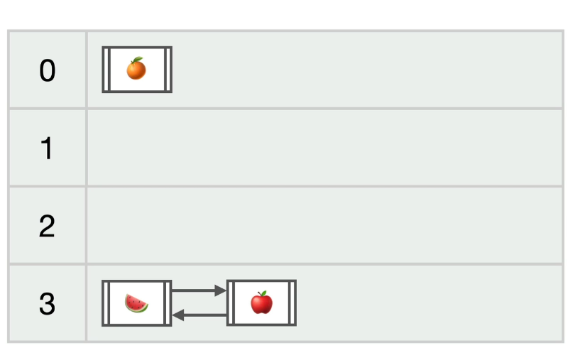

# Anotações 

Coleções = Varios objetos do mesmo tipo.

interface: (Boas praticas: sempre usar o super tipo) kkkk se tiver bronca fazer o casting com Collection
   Collection: = Raiz das Coleções
        herda: List 
            herda: ArrayList
            herda: LinkedList
            herda: Vector
        herda: Set
            herda: HashSet
            herda: TreeSet
        herda: Map

* Listas recebe um indice 

#### toString() é da classe Object(implicita) = classe default de todas as classes.

List é uma boa pratica sempre usar o super tipo.

* List<Tipo parametrizado(serve para parametrizar o que a list pode receber)>

#### Conjuntos não aceitam valores repetidos.
* não tem indice
* interface Set<Tipo parametrizado>

### hashTables = tabela de espalhamento.
* Um valor de hash é atribuido a cada elemento.
*  A cada posição do array ele recebe uma list com elementos com algo em comum.
* Colisão de hash = 2 valores de hash iguais.(Performance má)
